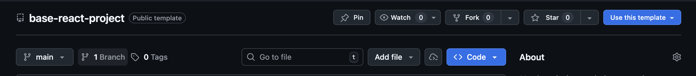

# Base React Project
> By Matteo Ghilardini  
> ---
> This is a template project for React applications using TypeScript and Vite.

## Project Structure
The project is organized into several key folders:
- `src/components/`: Contains reusable UI components.
- `src/features/`: Contains feature-specific views, components, and logic.
- `src/hooks/`: Contains custom React hooks.
- `src/types/`: Contains TypeScript type definitions.
- `src/app/`: Contains the main application component and global styles.
- `src/assets/`: Contains static assets like images and fonts.
- `src/utils/`: Contains utility functions and helpers.
- `src/tests/`: Contains test files for the application.

## Getting Started
I created this project considering that can be used as a base for new React applications.  
To get started, clone the repository and install the dependencies:
```bash
git clone <repository-url>
cd base-react-project
npm install
```
Otherwise you can use this template directly when creating a new repository on GitHub.  
To do so, click on **"Use this template"** button on the repository page, on the top right.
